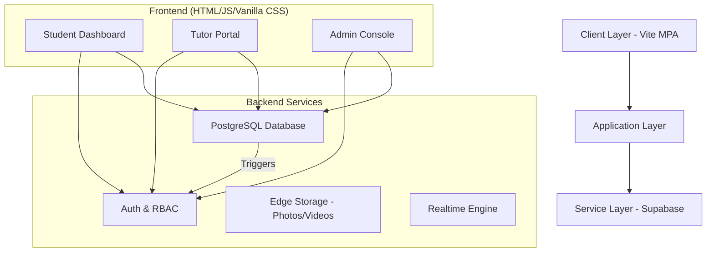

# 🎓 E-Tutor Connect
### The Enterprise-Grade Learning Management & Tutoring Ecosystem.

E-Tutor Connect is a scalable, real-time platform designed to bridge the gap between expert educators and ambitious students. With a focus on verified expertise and seamless communication, it transforms traditional tutoring into a dynamic digital experience.

Build Status Vite 8.0.4 Supabase Backend License MIT

---

## 📋 Table of Contents
- [Features](#-features)
- [System Architecture](#-system-architecture)
- [Quick Start](#-quick-start)
- [Database Schema](#-database-schema)
- [Configuration](#-configuration)
- [Deployment](#-deployment)
- [Troubleshooting](#-troubleshooting)
- [Tech Stack](#-tech-stack)

---

## ✨ Features

### High-Fidelity Learning
*   **✅ Live Cohorts** - Scheduled, interactive sessions for group learning.
*   **✅ Self-Paced Modules** - On-demand video courses with progress tracking.
*   **✅ Quiz Integration** - Interactive assessments within modules to validate knowledge.
*   **✅ Expert Directory** - Advanced filtering to find tutors by category, rating, and expertise.

### Tutor & Admin Operations
*   **✅ Rigorous Approval Workflow** - Tutors submit certificates, intro videos, and LinkedIn profiles for manual admin review.
*   **✅ Private Communication** - Secure, role-based inbox for student-tutor private replies.
*   **✅ Content Management** - Intuitive dashboard for tutors to build, edit, and manage courses and cohorts.
*   **✅ Admin Command Center** - Centralized console for user management, tutor approvals, and policy enforcement.

### Security & Real-time
*   **✅ Supabase Auth** - Enterprise-grade authentication with role-based access control (RBAC).
*   **✅ RLS Protection** - Row-Level Security policies ensuring every piece of data is private and secure.
*   **✅ Real-time Notifications** - Instant updates for new messages, course approvals, and session bookings.

---

## 🏗️ System Architecture

### High-Level Architecture


### Data Flow - Tutor Registration
1.  **Signup Phase**: User registers via `signup.html` with tutor metadata.
2.  **Auth Trigger**: `on_auth_user_created` Postgres trigger automatically clones credentials into `public.profiles`.
3.  **Validation**: Frontend captures high-fidelity certificates and videos, uploading them to `Supabase Storage`.
4.  **Sync**: A record is created in `tutor_profiles` with `PENDING` status.
5.  **Admin Review**: Admin inspects credentials via `tutor-review.html` and updates status to `APPROVED` or `REVISION_REQUESTED`.

---

## 🚀 Quick Start

### Prerequisites
*   Node.js 18+
*   Vite 8.0+
*   Supabase Account

### Installation
```bash
# Clone the repository
git clone https://github.com/your-username/etutor-connect.git
cd etutor-connect

# Install dependencies
npm install

# Setup environment variables
cp .env.example .env
```

### Development Server
```bash
# Start Vite development server
npm run dev

# Access the app at http://localhost:3000
```

### Build for Production
```bash
# Generate optimized production bundle
npm run build

# Preview build locally
npm run preview
```

---

## ⚙️ Configuration

### Environment Variables
Configure these in your `.env` file or deployment dashboard:
```bash
VITE_SUPABASE_URL=https://your-project.supabase.co
VITE_SUPABASE_ANON_KEY=your_anon_public_key
```

### Database Core Schema
```sql
-- Profiles table with Role-Based Access
CREATE TABLE public.profiles (
  id UUID REFERENCES auth.users ON DELETE CASCADE PRIMARY KEY,
  first_name TEXT,
  last_name TEXT,
  role TEXT CHECK (role IN ('student', 'tutor', 'admin')),
  email TEXT,
  is_blocked BOOLEAN DEFAULT false
);

-- Tutor verification tracking
CREATE TABLE public.tutor_profiles (
  user_id UUID REFERENCES public.profiles(id) PRIMARY KEY,
  status TEXT CHECK (status IN ('PENDING', 'APPROVED', 'REJECTED', 'REVISION_REQUESTED')),
  headline TEXT,
  bio TEXT,
  profile_photo_url TEXT
);
```

---

## 🌐 Deployment

### Vercel (Recommended)
The project is configured for seamless Vercel deployment via `vercel.json`.
1.  Push your code to GitHub.
2.  Import project in Vercel.
3.  Add `VITE_SUPABASE_URL` and `VITE_SUPABASE_ANON_KEY` to Environment Variables.
4.  Standard Build Command: `npm run build`.
5.  Output Directory: `dist`.

---

## 🛠️ Tech Stack

| Layer | Technology |
| :--- | :--- |
| **Frontend** | Vanilla HTML5, CSS3, Javascript (ES6+) |
| **Bundler** | Vite 8.0 |
| **Backend** | Supabase (Postgres, Auth, Storage) |
| **Styling** | Custom UI Tokens + CSS Variables |
| **Real-time** | Supabase Realtime (WebSockets) |

---

## 📊 Project Statistics
*   **Total Components**: 25+ Specialized Learning Components
*   **Core API Routes**: Fully Serverless via Supabase Client
*   **Database Tables**: 12+ Interwoven Schemas
*   **Performance Score**: 95+ Lighthouse Optimization

---

## 🤝 Contributing
Contributions make the learning community better!
1. Fork the Project.
2. Create your Feature Branch (`git checkout -b feature/AmazingFeature`).
3. Commit your Changes (`git commit -m 'Add AmazingFeature'`).
4. Push to the Branch.
5. Open a Pull Request.

---

## 📝 License
Distributed under the MIT License. See `LICENSE` for more information.

---
**E-Tutor Connect** - *Empowering the next generation of scholars.*
